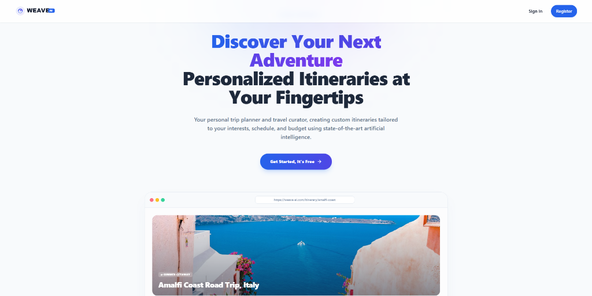
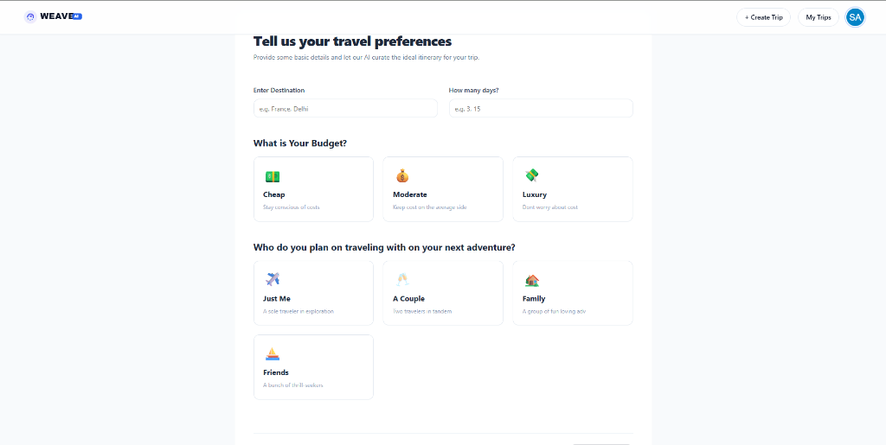
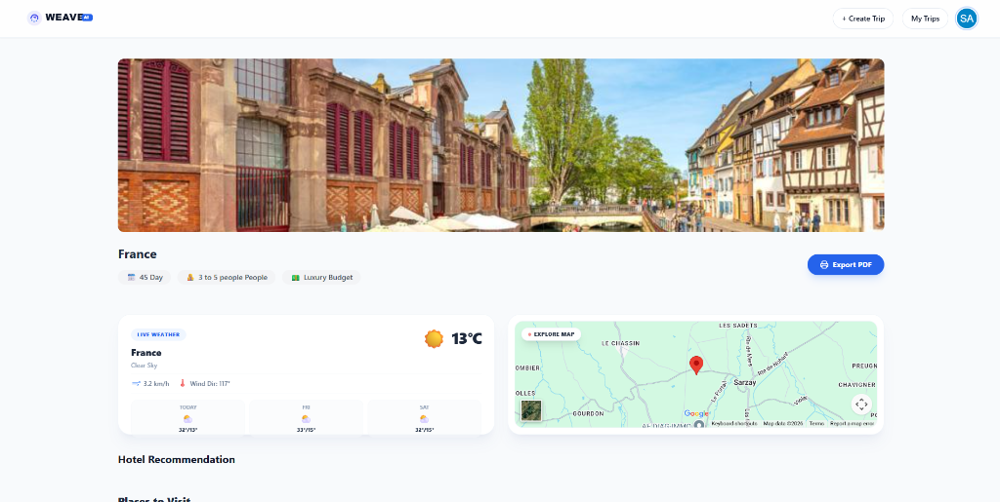
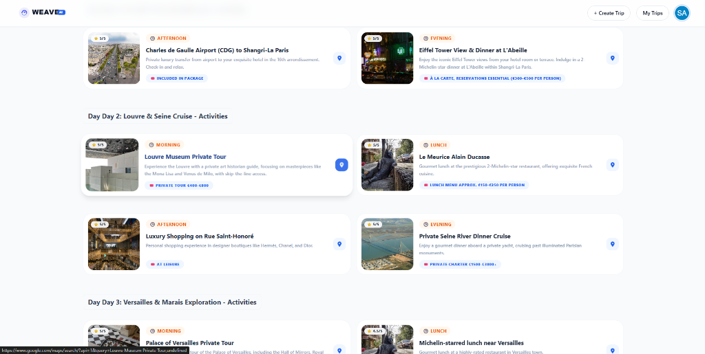
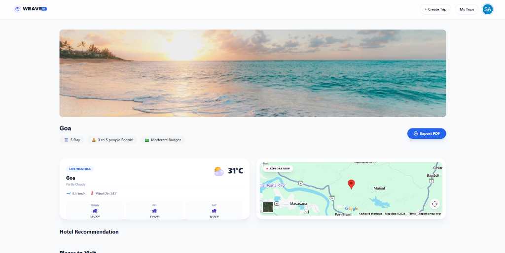

# <p align="center"><br>WEAVE AI - Smart Travel Planner</p>

<p align="center">
  
  
  
  
  
</p>

WEAVE AI is a state-of-the-art, full-stack travel planner and curator that leverages artificial intelligence to create personalized, highly-detailed travel itineraries based on user interests, budget, and traveler groups. It combines seamless cloud persistence with robust client-side failsafes and features dynamic widgets for real-time weather and interactive mapping.

---

## 📸 Application Showcase

### 1. SaaS Landing Page
Features a premium layout with glowing color meshes, modern split gradients, and a live CSS-coded dashboard mockup showing a trip generation preview.
<p align="center">
  
</p>

### 2. Tailored Travel Preferences Form
Clean, responsive user questionnaire allowing travelers to specify their destination, duration, budget, and group type.
<p align="center">
  
</p>

### 3. Dynamic Itinerary Dashboard (France)
Renders a curated cityscape banner, live weather data, 3-day weather forecasts, hotel options, and interactive Google Map embeds centered around the geocoded coordinates.
<p align="center">
  
</p>

### 4. Custom Curated Activity Cards (Paris)
Renders a responsive list of recommended day-by-day sightseeing destinations. Every card loads high-resolution local photography curated via Unsplash CDN dynamic search fallbacks.
<p align="center">
  
</p>

### 5. Custom Curated Beach Dashboard (Goa)
Displays Goa's scenic beaches, custom climate icons, and geocoded interactive map layers styled cleanly.
<p align="center">
  
</p>

---

## 🌟 Advanced Features

*   🧠 **Google Gemini 2.5 Flash Engine**: Dynamically constructs highly customized travel itineraries, optimizing models on-the-fly to ensure instant response times.
*   🌦️ **Live Weather Widget**: Automatically geocodes place names using OSM Nominatim and queries Open-Meteo to show current metrics (temperature, windspeed, wind direction) and a 3-day weather forecast with custom emojis.
*   🗺️ **Interactive Google Maps**: Centered dynamically around geocoded city coordinates, mounting a fully responsive map iframe with overlay labels.
*   📸 **Failsafe Unsplash Edge CDN Fallbacks**: Re-routes image loaders to dynamic Unsplash featured searches. If the Places API key is unpaid or restricted, the app dynamically downloads gorgeous, wide-angle landscape photos from Unsplash's Edge CDN in milliseconds, eliminating duplicate placeholders.
*   📄 **Native PDF Export Utility**: Adds a premium "Export PDF" button that triggers `window.print()`. Leverages detailed `@media print` rules inside `index.css` to hide headers/widgets and enforce page breaks cleanly between days and hotels.
*   💾 **Local Backup Failsafes**: If Firestore writes/reads encounter issues, the app transparently stores, loads, and merges trip histories under client-side local storage (`local_trips`), keeping user history 100% active.

---

## 🛠️ Installation & Setup

### 1. Clone & Install Dependencies
```bash
# Clone the repository
git clone https://github.com/sanjnathakur/sanjna-thakur.git

# Navigate into the project folder
cd sanjna-thakur

# Install npm dependencies
npm install
```

### 2. Configure Environment Variables
Create a `.env` file in the root folder and configure the following keys:
```env
VITE_GOOGLE_GEMINI_API_KEY=YOUR_GEMINI_API_KEY
VITE_GOOGLE_AUTH_CLIENT_ID=YOUR_GOOGLE_CLIENT_ID
VITE_GOOGLE_PLACES_API_KEY=YOUR_GOOGLE_PLACES_API_KEY
```

### 3. Run the Development Server
```bash
npm run dev
```
Open **http://localhost:5173** in your browser to explore!

### 4. Build for Production
```bash
npm run build
```

---

## 📄 License
This project is licensed under the MIT License.
